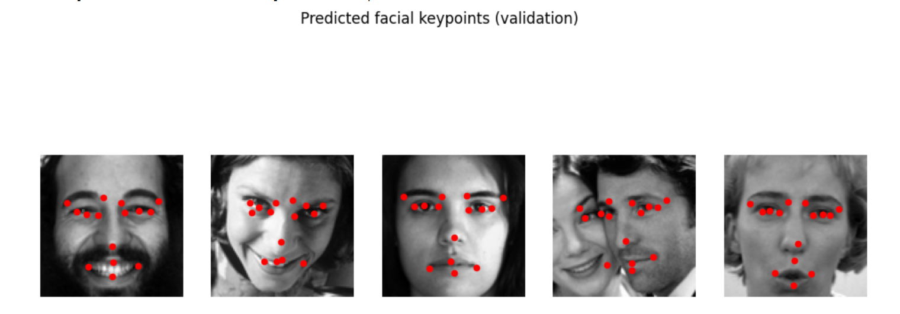
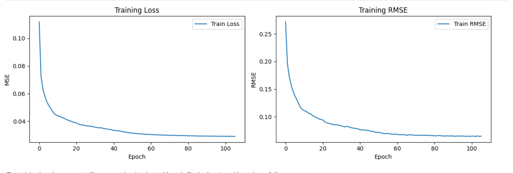
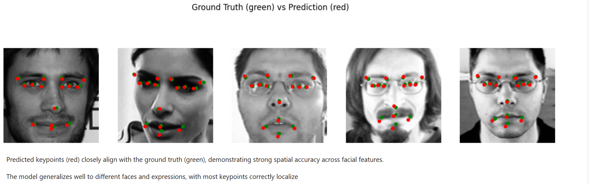
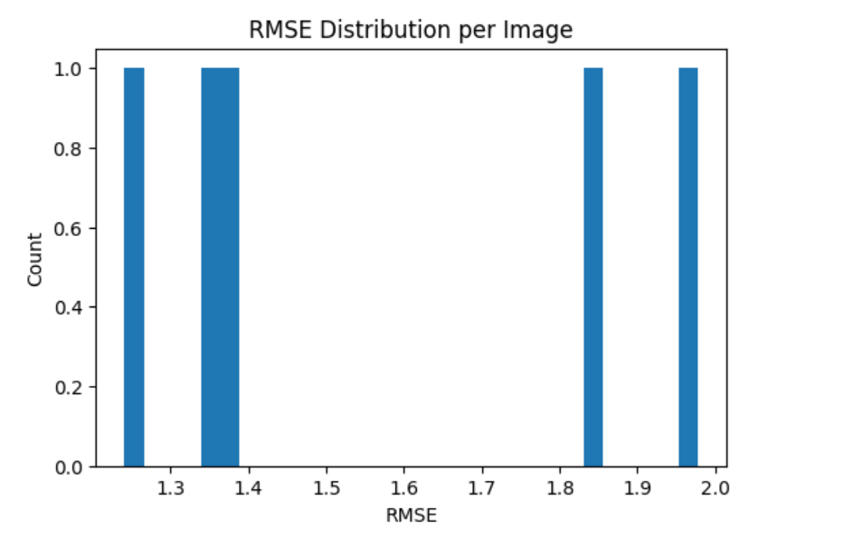

# 🙂 Facial Keypoints Detection (CNN)

This app predicts **facial keypoints** (eyes, eyebrows, nose, mouth) from a face image.

## 🔗 Demo & Code

- 🤗 HuggingFace Space: [https://huggingface.co/spaces/EnYa32/FacialKeypointDetectionCNN]
- 💻 GitHub Repository: [https://github.com/EnYa32/FacialKeypointDetectionCNN]


## 📊 Visual Results

**Predicted Facial Keypoints (Validation Samples)**  
Model predictions across multiple faces — keypoints align well with facial structures.



---

**Training Curves — Loss & RMSE**  
Stable convergence during CNN training with continuous error reduction.



---

**Ground Truth vs Prediction**  
Predicted keypoints (red) closely match ground truth (green) across most landmarks.



---

**RMSE Distribution per Image**  
Most samples show low spatial error, indicating consistent localization quality.




## 🎯 Task

Predict landmark coordinates for key facial regions:

- eyes  
- eyebrows  
- nose  
- mouth  

**Input:** face image  
**Output:** 30 regression values (x/y for 15 keypoints)

The app overlays predicted keypoints directly on the processed image.

## 🧠 Model

- Architecture: CNN (Keras)
- Task type: **multi-output regression**
- Output size: 30 coordinates
- Loss: regression loss (MSE)
- Input size: **96×96 grayscale**

## 🖥️ App Features

- Image upload (RGB or grayscale)
- Automatic preprocessing
- CNN inference
- Keypoint overlay visualization
- Coordinate table output

## Files in this repo
- `app.py` → Streamlit app
- `final_keypoints_cnn.keras` → trained Keras model
- `target_cols.json` → output column names (order of the 30 targets)
- `preprocess_config.json` → preprocessing settings (image size, normalization)

## ▶️ Run Locally

```bash
pip install -r requirements.txt
streamlit run src/streamlit_app.py

Resize to 96×96

Normalize pixels: x / 255.0

Model predicts normalized coordinates

Convert back to pixel space: y = y * 48 + 48

Clip to valid range: [0, 96]
